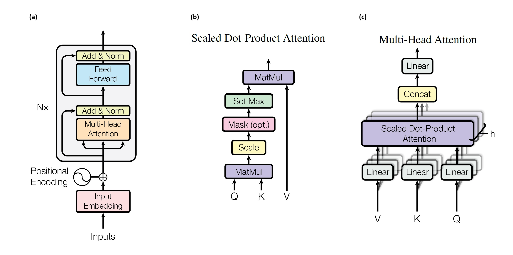

# 알라딘 베스트셀러 데이터셋을 이용한 attention encoder 기반 서적 가격 예측 모델

**사용된 스킬 셋**: NumPy, Pandas, Matplotlib, re, Scikit-learn, xgboost, PyTorch, [Mecab](https://pypi.org/project/python-mecab-ko/)

## 1. 프로젝트 개요

### 배경

- [알라딘 중고도서 가격 예측 프로젝트](https://github.com/kdt-3-second-Project/aladin_usedbook)에서 정가 column을 학습 데이터에서 제외하면 성능이 급격히 낮아진 것에 착안
- 데이터 셋에 포함된 도서 정보 중, 도서명이 중요한 독립변수 중 하나이므로 자연어 문장의 의미를 파악하는 것이 중요하리라 예상
- Attention을 이용한 Transformer[[1]][(VSPU17)]는 자연어 처리에서 맥락적 의미를 수치화하는데 특출난 성능과 연산속도를 보여 인공지능사에 한 획을 그은 모델

### 목표

- [알라딘 중고도서 가격 예측 프로젝트](https://github.com/kdt-3-second-Project/aladin_usedbook)에서 구축한 데이터 셋을 이용해, 도서 정보로 정가를 예측하는 회귀 모델 개발
- Attention 기반 모델을 PyTorch를 이용해 설계 및 학습 진행
  - Attention 및 Transformer에 대해 학습하는 차원에서 Pytorch를 이용해 직접 구현
- 기타 모델과 여러 성능 지표 및 실험을 통하여 Attention 기반 모델의 성능을 적절히 평가
  - Random Forest Regressor, XGBoost 등의 Machine learning 모델 및 Multilayer Perceptron 모델과 성능 비교

## 2. 데이터 셋

### 1) 개요

- 알라딘의 [주간 베스트셀러 페이지](https://www.aladin.co.kr/shop/common/wbest.aspx?BranchType=1)에서 제공한 1~1000위에 대한 xls 파일 데이터를 이용하여 구성
- 2000년 1월 1주차 ~ 2024년 7월 2주차까지의 데이터를 포괄하며, 24-07-10 ~ 24-07-12에 수집 진행
- 총 158,084 종의 도서에 대한 정보로 구성되어 있음

*<b>도표.1</b> 알라딘 주간 베스트셀러 페이지 예시*

### 2) 구성

- 총 1,415,586개의 row와 랭킹, 구분, 도서 명, ItemId, ISBN13, 부가기호, 저자, 출판사, 출판일, 정가, 판매가, 마일리지, 세일즈 포인트, 카테고리, 날짜 12개의 column
  - **구분** : 국내도서, 외국도서 등으로 구분되어 있음
  - **ItemId** : 알라딘에서 부여한 해당 도서의 id. 숫자로만 구성
    - 새 책 기준의 id 값이 기재됐고, 한정판, 개정판 등의 경우도 별도의 id가 부여 됨
    - raw data에는 도서 외에도, 당시 베스트셀러였던 MD 굿즈, 강연 등도 포함되어 있음
    - 총 158,084 종의 도서에 대한 정보로 구성되어 있음
  - **날짜, 랭킹** : 해당 도서가 어떤 주차의 주간 베스트셀러 목록에 몇 위로 올랐는지
    - 하나의 도서가 다양한 주 차에서 다양한 랭킹의 베스트셀러로 등장
  - [**ISBN13, 부가기호**](https://blog.aladin.co.kr/ybkpsy/959340) : ISBN13은 전세계에서 공통적으로 사용하는 도서에 대한 id. 발행자 등의 정보가 포함되어 있음. 부가기호는 한국 문헌 보호 센터에서 부여하는 번호로, 예상 독자층에 대한 정보 등이 포함 되어 있음
  - **카테고리** : 도서가 어떤 장르에 속하는지에 대한 정보. 외국어, 종교, 사회과학, 건강/취미 등 총 24개 유형으로 분류
  - **세일즈 포인트**
    - 판매량과 판매기간에 근거하여 해당 상품의 판매도를 산출한 알라딘만의 판매지수이며, 매일 업데이트 됨
    - 최근 판매분에 가중치를 두어, 팔릴수록 올라가고 덜 팔리면 내려감
    - 최근 베스트셀러는 점수가 높으며, 꾸준히 팔리는 스테디셀러들도 어느 정도 점수를 유지
- 날짜 및 랭킹을 제외하고, 판매가, 세일즈 포인트 등은 크롤링 시점에서의 값이 저장됨

*<b>도표.2</b> 알라딘 주간 베스트 셀러*

## 3. 문제 설정

**목표**: 저자, 출판사, 출판일, 제목 등의 값을 이용하여 도서의 정가를 예측

### 1) 종속 변수/ 독립 변수

- 종속 변수를 제외한 항목 중에서 총 7개의 독립변수 선정
  - BName_sub (도서명에서 괄호 안의 내용), Author_mul (저자 등이 여러 명으로 표기되었는지 여부) 등 파생 항목 포함. 해당 내용은 전처리 파트에서 후술

  | 종속 변수 | 독립 변수 |
  |---------|---------|
  | RglPrice |BName, BName_sub, Author, Author_mul, Publshr, Pdate, Category |

  *<b>도표.3</b> 모델의 종속 변수 및 독립 변수*

### 2) 실험 설계

- sklearn을 이용하여 train 64%, validation 16%, test 20% 비율로 분리
  - train : 주간 베스트셀러 순위에 오른적 있는 도서에 대한 데이터 101,173건
  - valid : 주간 베스트셀러 순위에 오른적 있는 도서에 대한 데이터 25,294건
  - test : 주간 베스트셀러 순위에 오른적 있는 도서에 대한 데이터 31,617건
- Transformer의 encoder를 응용하여 도서 정가 예측에 효과적인 모델 설계
  - Random Forest Regressor, XGBoost 등의 Machine learning 모델 및 단순한 Multilayer Perceptron 모델과 성능 비교
- RMSE, MAPE, R2 Score 등의 회귀 평가 지표를 사용하여 성능을 각 모델 별로 분석
- 모델의 hyperparameter에 따른 성능의 차이 확인

## 4. [전처리](./code/)

### 1) 전체 과정

#### [베스트 셀러 목록 전처리](./code/step2_preprocess_bookinfo.py)

- 결측치 처리
  - 저자 명, 구분, 출판사, 카테고리 등에 결측치가 있는 행의 개수 1,214개
    - 실제 도서도 있지만, MD 굿즈, 강연등 도서가 아닌 데이터 다수 존재
- 중복 도서 처리 : 베스트 셀러 목록에 여러 번 오른 도서는 하나의 행만 남김
- [도서 명](./research/240716_check_bookinfo.ipynb)
  - 한자 처리
    - [hanja](https://github.com/suminb/hanja)을 이용해 한자를 한글로 변환. 한글 독음이 이미 있는 경우 중복되지 않게 처리
  - 숫자 처리
    - 숫자 사이 구분자 "," 정리 : ex) "1,000" -> "1000"
    - 로마 숫자를 아랍 숫자로 변환
    - 연도 표기 정리 : "\`00"의 형태로 표기된 년도를 정리
      - ex) "\`98 ~ \`07 기출문제 모음" -> "1998 ~ 2007 기출문제 모음"
  - 특수한 unicode로 기입된 문자를 흔히 쓰이는 특수문자로 변환
    - "&#"가 들어가는 token들이 있는지 확인 후 별도 처리
    - ex) "세 명의 삶 ＼ Q. E. D." -> "세 명의 삶 \ Q. E. D."
  - 괄호속 내용 추출 후 BName_sub column에 정리
    - ex) "전지적 루이 &후이 시점(양장본)" -> "(양장본)"만 BName_sub에 분리
- [저자 명](./research/240716_check_bookinfo2.ipynb)
  - 여러 명이 제작자로 기재된 경우, 맨 앞의 제작자만 남김
    - 여러 명이 기재되어 있었는지 여부를 Author_mul에 bool형태로 기록
      - ex) "김려원 글 김이후 그림" -> "김려원 글", True
  - 이름 뒤에 붙은 기타 문자열 처리
    - 역할에 대한 단어 : "글", "시", "역", "지음", "평역" 등 총 72가지
    - 다수의 사람이 참여했다는 의미의 단어
      - ex) "외 13인", "외 5명", "외"
- 출간일 : DateTime 타입으로 파싱
- ItemId, 정가, 판매가 : 정수 형태로 변환

#### [인코딩 및 스케일링](./research/240716_encoding_bookinfo.ipynb)

- validation 및 test set의 데이터가 전처리에 영향을 주지 않도록 주의하여 진행
  - train set을 전처리 하면서 결정된 함수 및 관련 내용들을 validation 및 test set에 일괄적으로 적용
- Mecab을 사용해 Category, BName,BName_sub 컬럼을 토큰화
- 도서 명(BName, BName_sub)과 카테고리는 하나의 corpus로 통합하여 정수 인코딩
  - 줄글의 일부가 아닌 책 제목이므로, train set의 해당 열에 포함 된 최대한 모든 토큰을 데이터 셋에 포함
- 출판사, 판매 지점, 저자 명에 대해서는 빈도 수 혹은 SalesPoint를 고려한 인기를 반영하여 정수 인코딩
- 날짜 관련 데이터 정수형으로 인코딩
- 단어 corpus 관련 열이 아닌 열에 대해 MinMaxScaling 진행
  - 도서 명(BName, BName_sub)과 카테고리는 이후 Embedding model에 학습시켜야 하므로 정수형 데이터를 가져야 함
  - 그 외의 열에 대해서는 attention layer를 적용하지 않기로 결정하여 scaling 진행

  

  *<b>도표.4</b> 전처리, 스케일링 후 최종 데이터 예시*

## 5. 모델 설계

- **INPUT** : (*batch_size*, 64) | **OUTPUT** : (*batch_size*, 1)
- self attention layer 기반의 encoder(이하 attention based encoder)에 Multilayer perceptron (이하 MLP) layer들을 연장한 모델
  - self attention layer는 행렬곱 및 내적의 연장이기 때문에, 병렬계산이 가능하고 parameter 수가 같다면 MLP에 비해 연산이 빠름
  - attention layer를 적극적으로 이용한 Transformer[[1]][(VSPU17)]는 문장에서 맥락을 수치화하여 파악하는데 효과적인 성능을 보이고 있음
  - 이번 과제도 단어가 나열됐을 때 형성되는 맥락과 관련되어 있다 이해할 수 있기 때문에, attention based encoder 모델이 효과적일 수 있을 것이라 예상
- attention based encoder 내부에 Transformer에서 사용된 encoder submodule을 N=6층 쌓고, 3층의 MLP를 연장
- **[attention based encoder](./module_aladin/attention_based_model.py)** : (*batch_size*, 60) -> (*batch_size*, *d_model* , 60)
  - Transformer의 encoder submodule을 응용해서 단어가 나열된 부분의 문맥 정보를 수치화 하기 위한 의도
  - PyTorch로 Transformer를 layer 레벨부터 구현한 코드[[2]][(K19)]를 참고하여 구현
  - corpus에 대한 정수 encoding이 사용된 [0,60] 번째에 해당하는 tensor를 입력받음
    - 모델 입력 중 Category, BName, BName_sub 정보를 사용
  - 세부 내용

    |입력 형태|설명|
    |:-:|-|
    | (*batch_size*, 60)| vocab_size 크기의 corpus를 기반으로 한 Embedding model이 *d_model* 차원의 tenseor에 대응시킴 |
    | (*batch_size*, *d_model* , 60)| multihead attention layer, feed forward layer로 이뤄진 N개의 encoder submodule를 통과 |

    *<b>도표.5</b> encoder module의 부분 별 설명*

    
    
    *<b>도표.6.</b> <b>a.</b> attention based encoder module, <b>b.</b> scaled dot-product attention, <b>c.</b> multi-head attention [[1]][(VSPU17)]*

    |입력 형태|설명|
    |:-:|-|
    | (*batch_size*, 60)| vocab_size 크기의 corpus를 기반으로 한 Embedding model이 *d_model* 차원의 tenseor에 대응시킴 |
    | (*batch_size*, *d_model* , 60)| multihead attention layer, feed forward layer로 이뤄진 N개의 encoder submodule를 통과 |

    *<b>도표.7</b> encoder submodule의 구성*

    |d_model |vocab_size|N|head |d_k |d_v |d_ff |dropout|
    |:-:|:-:|:-:|:-:|:-:|:-:|:-:|:-:|
    |60  | 32050   |6|6    |10  |10  |128  |0.1    |

    *<b>도표.8</b> encoder submodule 관련 hyperparameter 값*

- **MLP module** : (*batch_size*, *d_model* , 60), (*batch_size*, 4) -> (*batch_size*, 1)
  - encoder module의 출력과 corpus와 무관한 feature들을 종합하여 model output 예측
    - 해당 feature : Author, Author_mul, Publshr, Pdate
  - concat layer의 output 형태를 (*batch_size*, *d_mlp*)라 하면, *d_mlp* = *d_model* * 60 + 4
  - 활성화 함수 : ReLU, dropout : 0.1 적용
  - 세부 내용

    |입력 형태|설명|
    |:-:|-|
    | (*batch_size*, *d_model* , 60), (*batch_size*, 4) | attention based encoder의 output과 model input 중 정수 encoding이 되지 않은 정보를 concat |
    | (*d_mlp*, *d_mlp* // 2) | 활성화 함수 및 dropout이 적용된 linear layer|
    | (*d_mlp* // 2, *d_mlp* // 2) | 활성화 함수 및 dropout이 적용된 linear layer|
    | (*d_mlp* // 2, 1) | model output으로 연결되는 linear layer|

    *<b>도표.8</b> MLP submodule의 layer별 설명*
  
<!--모델 구조도-->

## 6. 학습 및 평가 결과

### 개요

- 모델 성능은 RMSE, MAPE, $R^2$ Score 등을 활용하여 평가
- attention based encoder 모델 및 학습에서의 hyperparameter를 변경하며 학습 성능 평가
  - **batch size** : 256, 512, 4,096, 65,536에 대해서 실험 진행
    - *learning rate* : batch size에 맞게 초기 learning rate를 정한 뒤 학습 상황에 따라 감소시켜 적용
  - **head** : 3, 6, 12에 대해서 실험 진행
- 모델 성능의 평가를 위해 XGBoost, Random Forest Regressor 모델, 간단한 MLP모델과 성능 비교

<!--
### 평가 기준

- metric : RMSE, MAPE, $R^2$ score
- metric 별 성능에 가중치를 적용한 뒤 조화 평균으로 순위를 메김
  - 산술, 기하 평균에 비해 조화 평균은 값들 간의 차이가 크지 않은 것을 상대적으로 높게 평가
  - 세 metric에 대하여 고루 잘 예측하는 모델을 목표로 하기 때문에 조화 평균을 사용
-->
### 모델 평가

- 가독성을 고려하여 15개의 hyperparameter 중 각 실험에서 3위 안에 든 hyperparameter의 모음에 default(h0)를 포함한 8종에 대한 결과만 추려서 정리
- *Expt.1*
  - 학습 결과

  | **test1**|        h0 |        h1 |        h2 |        h3 |        h5 |        h7 |       h10 |       h12 |
  |:---------|----------:|----------:|----------:|----------:|----------:|----------:|----------:|----------:|
  | RMSE     | 791.45    | 624.77    | 610.14    | 605.39    | 612.01    | 611.04    | 629.77    | 631.19    |
  | MAPE     |   0.08123 |   0.06398 |   0.06264 |   0.06101 |   0.06162 |   0.06168 |   0.06322 |   0.06335 |
  | R2_SCORE |   0.95539 |   0.9722  |   0.97349 |   0.9739  |   0.97332 |   0.97341 |   0.97175 |   0.97163 |
  
  *<b>도표.14</b> Expt.1에서 test set으로 평가한 결과*

  | **test2**|         h0 |         h1 |         h2 |         h3 |         h5 |         h7 |        h10 |        h12 |
  |:---------|-----------:|-----------:|-----------:|-----------:|-----------:|-----------:|-----------:|-----------:|
  | RMSE     | 1461.59    | 1461.72    | 1463.05    | 1477.96    | 1469.03    | 1499.15    | 1606.71    | 1607.75    |
  | MAPE     |    0.13294 |    0.14177 |    0.15186 |    0.14469 |    0.14524 |    0.14276 |    0.1594  |    0.1551  |
  | R2_SCORE |    0.91175 |    0.91174 |    0.91158 |    0.90977 |    0.91085 |    0.90716 |    0.89336 |    0.89322 |
  
  *<b>도표.15</b> Expt.1에서 test set 중 train set에 포함된 적 없는 종류의 도서들에 대해 평가한 결과*

  | **평균** |         h0 |        h1 |        h2 |       <b> h3</b> |        h5 |        h7 |       h10 |       h12 |
  |:---------|-----------:|----------:|----------:|-----------------:|----------:|----------:|----------:|----------:|
  | RMSE     | 1026.86    | 875.38    | 861.15    | <b>858.95   </b> | 864.05    | 868.21    | 904.87    | 906.49    |
  | MAPE     |    0.10084 |   0.08817 |   0.0887  | <b>  0.08583</b> |   0.08653 |   0.08614 |   0.09053 |   0.08996 |
  | R2_SCORE |    0.93306 |   0.941   |   0.94152 | <b>  0.94074</b> |   0.94105 |   0.93912 |   0.93091 |   0.93078 |
  | 종합순위 |   11       |   4       |   1       | <b>  0      </b> |   2       |   3       |   9       |   8       |

  *<b>도표.16</b> Expt.1에서 두 평가에 대해 조화평균을 취하고 순위를 매긴 결과*

## 7. 결과 분석

  ||Expt.1|Expt.2|Expt.3|
  |:-|-:|-:|-:|
  |hyperparameter|h3|h5|h10|
  |RMSE|858.95|857.75|1525.96|
  |MAPE|0.08583|0.08718|0.15823|
  |R2 SCORE|0.94074|0.94294|0.66289|

  *<b>도표.29</b> 각 실험 별 best model과 성능*

## 8. 결론 및 한계

### 결론

- 간단한 Machine-learning 모델과 multilayer perceptron으로는 성능이 

### 한계 평가

- 정가 예측에 큰 도움을 줄 수 있는 추가적인 정보(제본 형태, 쪽수 등)를 데이터셋에 추가하지 않고 학습 진행
- Attention을 이용한 다양한 모델, 특히 attention layer로만 구성된 모델을 이용한 학습을 시도해보지 못함
- 행렬 계산을 이용한 Transformer 모델이 연산속도 측면에서 갖는 장점을 충분히 활용했는지 평가 필요
  - d_model의 값이 커도 모델의 step 당 연산 속도에 큰 영향을 주지 않는 것이 연산 속도 측면에서 큰 장점
  - d_model의 값이 크면 parameter의 개수가 많아지므로, 원활한 학습에 필요한 데이터 양, step 등이 커질 수 있음
  - 따라서 d_model의 값을 설정할 때 한계가 있는 상황인데, 데이터 셋을 확장하는 등 d_model을 늘려도 괜찮을 수 있는 조치를 취하지 않음
- 학습시 연산 자원을 효율적으로 사용했는지 의문이 있음
  - 학습 과정에서 RAM과 GPU 자원의 사용률이 10% 내외였던 것을 감안하면, 더 효율적인 방법이 있는지 찾아보는 것이 필요했음
  - Dataloader를 만드는 과정에서 GPU에 할당할 경우, num_worker를 설정할 수 없는 것을 우회하는 방향을 시도해보지 못함
- 저자명, 출판사를 인코딩 중 기타 항목으로 처리할 때 threshold 기준의 구체적인 근거를 제시하지 못 함
  - 추가적인 조사를 통해 더 객관적이고 제시 가능한 근거 확립 가능

## 9. 추후 과제

- 학습 및 예측 속도를 향상시키기 위해 할 수 있는 조치를 조사
- d_model, d_ff, head 개수, N 등의 모델 구조 관련 hyperparameter를 변경했을 때 성능이 어떻게 달라지는지 탐구
- Attention layer만을 이용한 모델 개발 및 성능 비교
  - 단어 corpus를 다른 열의 내용에 대하여도 확장하거나, 다른 embedding model로 vector화 된 정보들이 섞여있을 경우 학습에 주의 할 점 조사
- 데이터를 보강하여 학습에 수월한 질 좋은 데이터셋 구성
  - 도서 정보 페이지에 정보 중, 도서 정가에 직접적인 영향을 주는 다른 정보(제본형태, 쪽수 등)를 추가적으로 크롤링
  - 베스트 셀러에 포함된 적 없는 도서도 대상으로 하기 위한 크롤링 방법 개발 필요
- 위의 모델 외에도 다양한 모델 개발 가능
  - 카테고리와 도서 명, 출판사, 정가 등의 정보로 출간 연도 예측
  - 도서 정보 및 중고 시장에서의 가격을 바탕으로 알라딘의 SalesPoint 산정법 추정

## 10. 참고문헌

1. [VSPU17][(VSPU17)]: Vaswani, Ashish and Shazeer, Noam and Parmar, Niki and Uszkoreit, Jakob and Jones, Llion and Gomez, Aidan N and Kaiser, Lukasz and Polosukhin, Illia, Attention is All you Need, Advances in Neural Information Processing Systems, 30, 2017
2. [K19][(K19)]: hyunwoongko, transformer, GitHub, 2019

[(VSPU17)]:https://arxiv.org/abs/1706.03762 "VSPU17"
[(K19)]:https://github.com/hyunwoongko/transformer/tree/master "K19"
