# 알라딘 베스트셀러 데이터셋을 이용한 encoder-only transformer 도서 정가 예측 모델

**사용된 스킬 셋**: PyTorch, NumPy, Pandas, Matplotlib, re, Scikit-learn, xgboost, [Mecab](https://pypi.org/project/python-mecab-ko/)

## 0. 초록

## 1. 프로젝트 개요

### 배경

- [알라딘 중고도서 가격 예측 프로젝트 [1]][(OLPJ24)]에서 정가 column을 학습 데이터에서 제외하면 성능이 급격히 낮아진 것에 착안
- 데이터 셋에 포함된 도서 정보 중, 도서명이 중요한 독립변수 중 하나이므로 자연어 문장의 의미를 파악하는 것이 중요하리라 예상
- Attention을 이용한 Transformer[[1]][(VSPU17)]는 자연어 처리에서 맥락적 의미를 수치화하는데 특출난 성능과 연산속도를 보여 인공지능사에 한 획을 그은 모델

### 목표

- 알라딘 중고도서 가격 예측 프로젝트[[1]][(OLPJ24)]에서 구축한 데이터 셋을 이용해, 도서 정보로 정가를 예측하는 회귀 모델 개발
- Attention 기반 모델을 PyTorch를 이용해 설계 및 학습 진행
  - Attention 및 Transformer에 대해 학습하는 차원에서 Pytorch를 이용해 직접 구현
  - *step 수*와 *learning rate* 사이에, 논문에서 소개 된 *learning rate* 관련 식[[2]][(VSPU17)]에서와 동일한 관계를 갖는지 확인
- 기타 모델과 여러 성능 지표 및 실험을 통하여 Attention 기반 모델의 성능을 평가
  - Random Forest Regressor, XGBoost 등의 Machine learning 모델 및 Multilayer Perceptron 모델과 성능 비교

## 2. 데이터 셋 [[1]][(OLPJ24)]

### 1) 개요

- 알라딘의 [주간 베스트셀러 페이지](https://www.aladin.co.kr/shop/common/wbest.aspx?BranchType=1)에서 제공한 1~1000위에 대한 xls 파일 데이터를 이용하여 구성
- 2000년 1월 1주차 ~ 2024년 7월 2주차까지의 데이터를 포괄하며, 24-07-10 ~ 24-07-12에 수집 진행
- 총 158,084 종의 도서에 대한 정보로 구성되어 있음

*<b>도표.1</b> 알라딘 주간 베스트셀러 페이지 예시*

### 2) 구성

- 총 1,415,586개의 row와 랭킹, 구분, 도서 명, ItemId, ISBN13, 부가기호, 저자, 출판사, 출판일, 정가, 판매가, 마일리지, 세일즈 포인트, 카테고리, 날짜 12개의 column
  - **구분** : 국내도서, 외국도서 등으로 구분되어 있음
  - **ItemId** : 알라딘에서 부여한 해당 도서의 id. 숫자로만 구성
    - 새 책 기준의 id 값이 기재됐고, 한정판, 개정판 등의 경우도 별도의 id가 부여 됨
    - raw data에는 도서 외에도, 당시 베스트셀러였던 MD 굿즈, 강연 등도 포함되어 있음
    - 총 158,084 종의 도서에 대한 정보로 구성되어 있음
  - **날짜, 랭킹** : 해당 도서가 어떤 주차의 주간 베스트셀러 목록에 몇 위로 올랐는지
    - 하나의 도서가 다양한 주 차에서 다양한 랭킹의 베스트셀러로 등장
  - [**ISBN13, 부가기호**](https://blog.aladin.co.kr/ybkpsy/959340) : ISBN13은 전세계에서 공통적으로 사용하는 도서에 대한 id. 발행자 등의 정보가 포함되어 있음. 부가기호는 한국 문헌 보호 센터에서 부여하는 번호로, 예상 독자층에 대한 정보 등이 포함 되어 있음
  - **카테고리** : 도서가 어떤 장르에 속하는지에 대한 정보. 외국어, 종교, 사회과학, 건강/취미 등 총 24개 유형으로 분류
  - **세일즈 포인트**
    - 판매량과 판매기간에 근거하여 해당 상품의 판매도를 산출한 알라딘만의 판매지수이며, 매일 업데이트 됨
- 날짜 및 랭킹을 제외하고, 판매가, 세일즈 포인트 등은 크롤링 시점에서의 값이 저장됨

*<b>도표.2</b> 알라딘 주간 베스트 셀러*

## 3. 문제 설정

**목표**: 저자, 출판사, 출판일, 제목 등의 값을 이용하여 도서의 정가를 예측

### 1) 종속 변수/ 독립 변수

- 종속 변수를 제외한 항목 중에서 총 7개의 독립변수 선정
  - BName_sub (도서명에서 괄호 안의 내용), Author_mul (저자 등이 여러 명으로 표기되었는지 여부) 등 파생 항목 포함. 해당 내용은 전처리 파트에서 후술

  | 종속 변수 | 독립 변수 |
  |---------|---------|
  | RglPrice |BName, BName_sub, Author, Author_mul, Publshr, Pdate, Category |

  *<b>도표.3</b> 모델의 종속 변수 및 독립 변수*

### 2) 실험 설계

- sklearn을 이용하여 train 64%, validation 16%, test 20% 비율로 분리
  - train : 주간 베스트셀러 순위에 오른적 있는 도서에 대한 데이터 101,173건
  - valid : 주간 베스트셀러 순위에 오른적 있는 도서에 대한 데이터 25,294건
  - test : 주간 베스트셀러 순위에 오른적 있는 도서에 대한 데이터 31,617건
- Transformer의 encoder를 응용하여 도서 정가 예측에 효과적인 모델 설계
  - Random Forest Regressor, XGBoost 등의 Machine learning 모델 및 단순한 Multilayer Perceptron 모델과 성능 비교
  - RMSE, MAPE, R2 Score 등의 회귀 평가 지표를 사용하여 성능을 각 모델 별로 분석
- 적절한 learning rate와 기타 hyperparameter 사이의 관계가 기존 연구[[2]][(VSPU17)]에서와 비슷한 관계를 갖는지 확인

## 4. [전처리](./code/) [[1]][(OLPJ24)]

### [베스트 셀러 목록 전처리](./code/step2_preprocess_bookinfo.py)

- 결측치 처리
  - 저자 명, 구분, 출판사, 카테고리 등에 결측치가 있는 행의 개수 1,214개
    - 실제 도서도 있지만, MD 굿즈, 강연등 도서가 아닌 데이터 다수 존재
- 중복 도서 처리 : 베스트 셀러 목록에 여러 번 오른 도서는 하나의 행만 남김
- [도서 명](./research/240716_check_bookinfo.ipynb)
  - 한자 처리
    - [hanja](https://github.com/suminb/hanja)을 이용해 한자를 한글로 변환. 한글 독음이 이미 있는 경우 중복되지 않게 처리
  - 숫자 처리
    - 숫자 사이 구분자 "," 정리 : ex) "1,000" -> "1000"
    - 로마 숫자를 아랍 숫자로 변환
    - 연도 표기 정리 : "\`00"의 형태로 표기된 년도를 정리
      - ex) "\`98 ~ \`07 기출문제 모음" -> "1998 ~ 2007 기출문제 모음"
  - 특수한 unicode로 기입된 문자를 흔히 쓰이는 특수문자로 변환
    - "&#"가 들어가는 token들이 있는지 확인 후 별도 처리
    - ex) "세 명의 삶 ＼ Q. E. D." -> "세 명의 삶 \ Q. E. D."
  - 괄호속 내용 추출 후 BName_sub column에 정리
    - ex) "전지적 루이 &후이 시점(양장본)" -> "(양장본)"만 BName_sub에 분리
- [저자 명](./research/240716_check_bookinfo2.ipynb)
  - 여러 명이 제작자로 기재된 경우, 맨 앞의 제작자만 남김
    - 여러 명이 기재되어 있었는지 여부를 Author_mul에 bool형태로 기록
      - ex) "김려원 글 김이후 그림" -> "김려원 글", True
  - 이름 뒤에 붙은 기타 문자열 처리
    - 역할에 대한 단어 : "글", "시", "역", "지음", "평역" 등 총 72가지
    - 다수의 사람이 참여했다는 의미의 단어
      - ex) "외 13인", "외 5명", "외"
- 출간일 : DateTime 타입으로 파싱
- ItemId, 정가, 판매가 : 정수 형태로 변환

### [인코딩 및 스케일링](./research/240716_encoding_bookinfo.ipynb)

- validation 및 test set의 데이터가 전처리에 영향을 주지 않도록 주의하여 진행
  - train set을 전처리 하면서 결정된 함수 및 관련 내용들을 validation 및 test set에 일괄적으로 적용
- Mecab을 사용해 Category, BName,BName_sub 컬럼을 토큰화
- 도서 명(BName, BName_sub)과 카테고리는 하나의 corpus로 통합하여 정수 인코딩
  - 줄글의 일부가 아닌 책 제목이므로, train set의 해당 열에 포함 된 최대한 모든 토큰을 데이터 셋에 포함
- 출판사, 판매 지점, 저자 명에 대해서는 빈도 수 혹은 SalesPoint를 고려한 인기를 반영하여 정수 인코딩
- 날짜 관련 데이터 정수형으로 인코딩
- 단어 corpus 관련 열이 아닌 열에 대해 MinMaxScaling 진행
  - 도서 명(BName, BName_sub)과 카테고리는 이후 Embedding model에 학습시켜야 하므로 정수형 데이터를 가져야 함
  - 그 외의 열에 대해서는 attention layer를 적용하지 않기로 결정하여 scaling 진행

  

  *<b>도표.4</b> 전처리, 스케일링 후 최종 데이터 예시*

## 5. 실험 설계

### 모델 설계

#### Encoder Based Model

- **INPUT** : (*batch_size*, 64) $\rightarrow$ **OUTPUT** : (*batch_size*, 1)
- self attention layer 기반의 encoder(이하 attention based encoder)에 multilayer perceptron (이하 MLP) layer들을 연장한 모델(이하 encoder based model)
  - self attention layer는 행렬곱 및 내적의 연장이기 때문에, 병렬계산이 가능하고 parameter 수가 같다면 MLP에 비해 연산이 빠름
  - attention layer를 적극적으로 이용한 Transformer[[2]][(VSPU17)]는 문장에서 맥락을 수치화하여 파악하는데 효과적인 성능을 보이고 있음
  - 이번 과제도 단어가 나열됐을 때 형성되는 맥락과 관련되어 있다 이해할 수 있기 때문에, encoder-only Transformer 모델이 효과적일 수 있을 것이라 예상
- attention based encoder 내부에 Transformer에서 사용된 encoder submodule을 N=6층 쌓고, 3층의 MLP를 연장
- **[attention based encoder](./module_aladin/attention_based_model.py)** : (*batch_size*, 60) $\rightarrow$ (*batch_size*, *d_model* , 60)
  - Transformer의 encoder submodule을 응용해서 단어가 나열된 부분의 문맥 정보를 수치화 하기 위한 의도
  - PyTorch로 Transformer를 layer 레벨부터 구현한 코드[[3]][(K19)]를 참고하여 구현
  - corpus에 대한 정수 encoding이 사용된 [0,60] 번째에 해당하는 tensor를 입력받음
    - 모델 입력 중 Category, BName, BName_sub 정보를 사용
  - dropout은 encoder submodule의 multi-head self attention layer, feed-forward network layer에 각각 적용됨
  - 세부 내용

    |명칭|입력 형태|설명|
    |:-:|:-:|-|
    | embedding model | (*batch_size*, 60) | *vocab_size* 크기의 corpus를 기반으로 한 모델로, *d_model* 차원의 tenseor에 대응 |
    |encoder submodule | (*batch_size*, *d_model* , 60)|multi-head self attention layer, feed forward layer로 이뤄졌고, *N* 번 반복됨 |

    *<b>도표.5</b> encoder module의 구성*

    
    *<b>도표.6.</b> <b>a.</b> attention based encoder module, <b>b.</b> scaled dot-product attention, <b>c.</b> multi-head attention [[2]][(VSPU17)]*

    |명칭|입력 형태|설명|
    |:-:|:-:|-|
    |positional encoding | (*batch_size*, *d_model*, 60)| 삼각함수 이용|
    |multi-head   self attention layer| (*batch_size*, *d_model*, 60)| *d_k*, *d_k*, *d_v* 에 맞는 구조의 scaled dot-product attention이 *head* 개|
    |add & norm| (*batch_size*, *d_model* , 60),   (*batch_size*, *d_model* , 60)| add residual & normalize |
    |feed forward layer1 | (*batch_size*, *d_model* , 60)| ReLU가 적용 된 linear layer|
    |feed forward layer2 | (*batch_size*, *d_model* , *d_ff*)| linear layer|
    |add & norm| (*batch_size*, *d_model* , 60),   (*batch_size*, *d_model* , 60)| add residual & normalize|

    *<b>도표.7</b> encoder submodule의 구성*

    |*d_model* |*vocab_size*|*N*|*head* |*d_k* |*d_v* |*d_ff* |*dropout*|
    |:-:|:-:|:-:|:-:|:-:|:-:|:-:|:-:|
    |60  | 32050   |6|6    |10  |10  |128  |0.1    |

    *<b>도표.8</b> encoder submodule 관련 hyperparameter 값*

#### 대조군

- **MLP module** : (*batch_size*, *d_model* , 60), (*batch_size*, 4) $\rightarrow$ (*batch_size*, 1)
  - encoder module의 출력과 corpus와 무관한 feature들을 종합하여 model output 예측
    - 해당 feature : Author, Author_mul, Publshr, Pdate
  - concat layer의 output 형태를 (*batch_size*, *d_mlp*)라 하면, *d_mlp* = *d_model* * 60 + 4
  - 활성화 함수, dropout : 각각 ReLU, 0.1 적용
  - 세부 내용

    |입력 형태|설명|
    |:-:|-|
    | (*batch_size*, *d_model* , 60), (*batch_size*, 4) | attention based encoder의 output과 model input 중 정수 encoding이 되지 않은 정보를 concat |
    | (*d_mlp*, *d_mlp* // 2) | 활성화 함수 및 dropout이 적용된 linear layer|
    | (*d_mlp* // 2, *d_mlp* // 2) | 활성화 함수 및 dropout이 적용된 linear layer|
    | (*d_mlp* // 2, 1) | model output으로 연결되는 linear layer|

    *<b>도표.9</b> MLP submodule의 layer별 설명*
  
<!--

### learning rate 관련 실험

- *patience* 만큼 *score*의 개선이 없으면 *factor* 배 *learning rate*를 감소시키는 scheduling을 사용 예정
- *learning rate*를 지수적으로 감소시키는 scheduling을 하기 위해서는 설정이 처음 Transformer가 제안 된 논문에서와 달라야 함
  - <i>수식 1[[2]][(VSPU17)]</i>와 같이 <i>step_num-0.5</i>에 비례하여 *learning_rate*를 변화시킴

    

    *<b>수식. 1</b> Transformer 모델 제안 때 사용된 step_num에 따른 learnig rate 값*
- 다음 내용을 가정하면, 아래의 전개를 통해 지수적으로 scheduling할 경우 <i>수식 2</i>과 같이 *initial learning rate*과 학습이 완료되는 epoch 사이 관계식을 가질 것이라 추정할 수 있다.
  - 이 실험에 쓰인 모델에도 수식 1이 유효
  - 전체 학습 동안의 *learning rate*의 합이 parameter가 바뀐 경로의 길이와 관련
  - 학습의 진행 정도와 경로의 길이가 관련있고, 모델 학습이 충분히 진행되기 위해서는 경로의 길이가 특정 수치 이상이 되어야 함
  - 동일한 optimizer를 사용했을 때, 경로의 길이가 유사하면 모델 학습도 수준에 도달할 수 있을 것이다?
  - (간략하게 아이디어를 진행해도 될 것이다)
-->

## 6. 실험 결과

### 시뮬레이션 설정

- 모델 성능은 RMSE, MAPE, $R^2$ Score 등을 활용하여 평가
- encoder based model 학습에서의 hyperparameter를 변경하며 학습 성능 평가
- **batch size** : 20480
- **optimizer** : Adam
  |adam_eps|weight_decay|
  |-:|-:|
  |5e-7|5e-20|

  *<b>도표.10</b> optimizer 관련 hyperparameter*

- **learning rate**
  - 초기값을 1.5e-4 에서 5.6e-4 사이 7개의 값 중 하나로 설정해서 진행
  - *initial learning rate* 값에 따라 20번 내외 혹은 40번 내외 시뮬레이션 시행

    |init_lr| count |
    |-:|-:|
    |1.76e-4| 35 |
    |2.84e-4| 39 |
    |3.92e-4| 41 |
    |4.46e-4| 23 |
    |5.00e-4| 19 |
    |5.27e-4| 19 |
    |5.54e-4| 24 |
    |<b>계</b>|<b>200</b>|

    *<b>도표.11</b> initial learing rate 설정 값 별 시행 횟수*

    - *init_lr* 별로 시행 횟수가 다른 것은, 20번 내외 반복한 경우 데이터를 2배로 하는 oversampling을 적용하여 보완
  - *scheduler* : torch.optim.lr_scheduler.ReduceLROnPlateau 사용

    |factor|patience|warmup|
    |-:|-:|-:|
    |0.95|10|3|
  
    *<b>도표.12</b> learning rate scheduler 관련 hyperparameter*

    - *patience* 만큼의 *epoch* 동안 성능의 개선이 없으면 *lr*을 *factor*배 하여 진행
    - 단, *warmup* 이하의 *epoch* 까지는 scheduler가 *lr* 업데이트 하지 않음
    - e.g. 위 hyperparmeter로 550 epoch을 진행했을 때 *lr*이 최대한 감소한 경우, *init_lr*의 $0.95^{54} \sim 0.0627$배 까지 감소 가능

- 기타 hyperparameter

  |clip|dropout|
  |-:|-:|
  |1.0|0.1|

  *<b>도표.13</b> model 학습 hyperparameter*

  - *clip* : torch.nn.clip_grad_norm_을 적용해 gradient exploding을 방지
    - parameter의 $L^2$ norm의 최대 값을 *clip* 값으로 제한
- *epoch* : 각 실험 별로 early stopping 없이 550 epoch 까지 진행
  - *best_epoch* : 학습 과정 중에 가장 *valid_loss*가 작았을 때
- **loss funcion** : RMSE
- 모델 성능의 평가를 위해 XGBoost, Random Forest Regressor 모델, 간단한 MLP모델과 성능 비교

### 시뮬레이션 결과

#### *init_lr* 별 실험 결과

  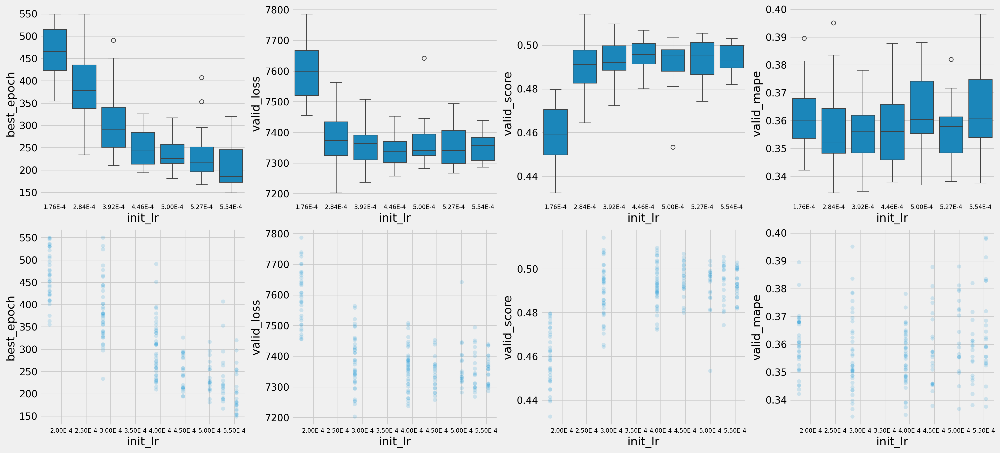

  *<b>도표.14</b> 각 init_lr 별 best_epoch 및 성적의 분포*

  |          |   count |    mean |     std |   min |     q1 |   median |    q3 |   max |
  |---------:|--------:|--------:|--------:|------:|-------:|---------:|------:|------:|
  | 0.000176 |      35 | 465.143 | 55.8001 |   355 | 423.5  |      466 | 515.5 |   550 |
  | 0.000284 |      39 | 387.897 | 69.5591 |   234 | 338    |      379 | 435.5 |   550 |
  | 0.000392 |      41 | 301.293 | 64.9639 |   210 | 251    |      290 | 341   |   491 |
  | 0.000446 |      23 | 248.609 | 38.6179 |   194 | 213.5  |      243 | 284.5 |   326 |
  | 0.0005   |      19 | 238.263 | 36.1691 |   181 | 215    |      226 | 258   |   317 |
  | 0.000527 |      19 | 235.211 | 60.8071 |   167 | 196    |      218 | 252   |   407 |
  | 0.000554 |      24 | 204.875 | 48.1441 |   149 | 172.75 |      186 | 245.5 |   320 |

  *<b>도표.15</b> 각 init_lr 별 best_epoch의 분포*
  
  - 각 시행별 best model이 몇 번째 epoch였는지, RMSE, $R^2$ Score, MAPE는 어떻게 나오는지 확인
  - 학습 등에 관한 hyperparameter들을 고정했을 때, 각 *init_lr* 별로 *best_epoch*가 특정 값 언저리에서 나오는 것을 확인할 수 있음
  - *init_lr* = 1.76e-4인 경우, 다른 경우와 다르게 최종 *epoch*가 550으로 제한 된 것의 영향을 받아, RMSE 및 R2 Score의 평균적인 성능이 상대적으로 떨어지는 것으로 추론
  
  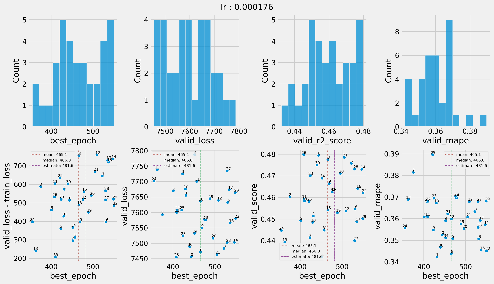
  *<b>도표.16</b> init_lr= 0.000176일 때 best epoch 및 성적 분포*

  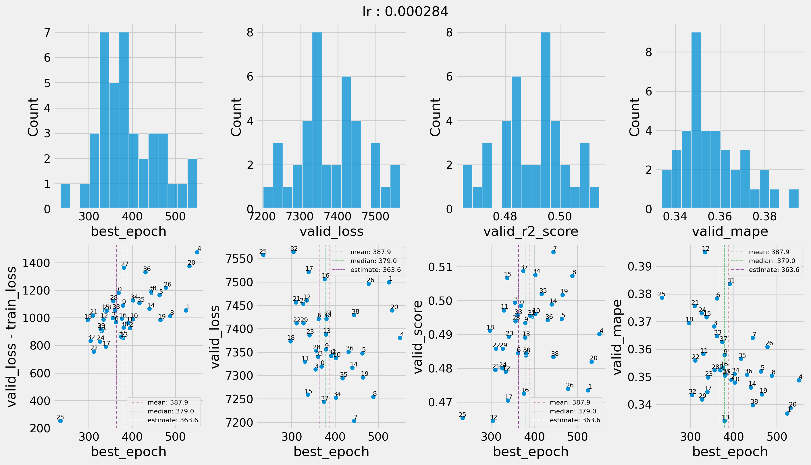
  *<b>도표.17</b> init_lr = 0.000284일 때 best epoch 및 성적 분포*

  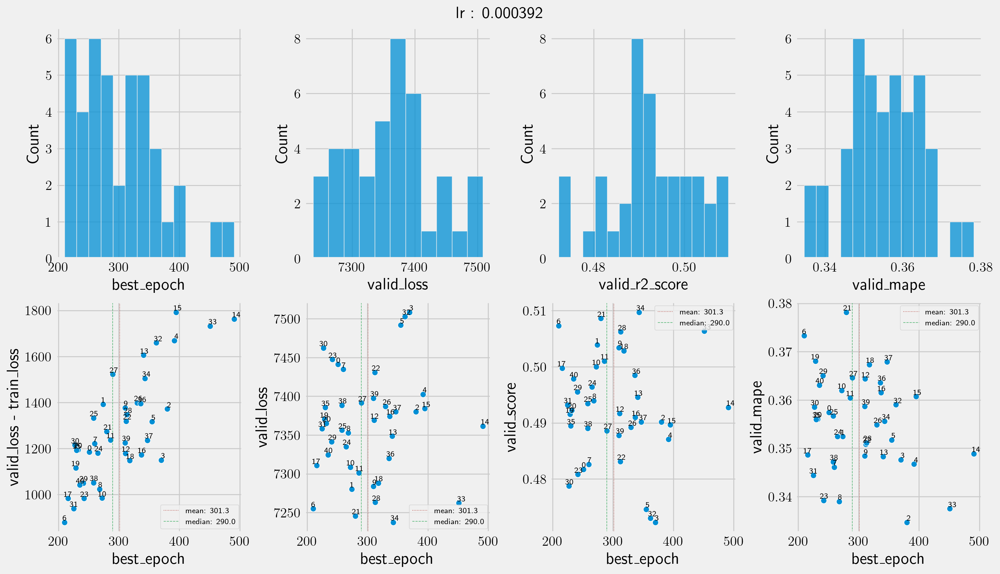
  *<b>도표.18</b> init_lr = 0.000392일 때 best epoch 및 성적 분포*

  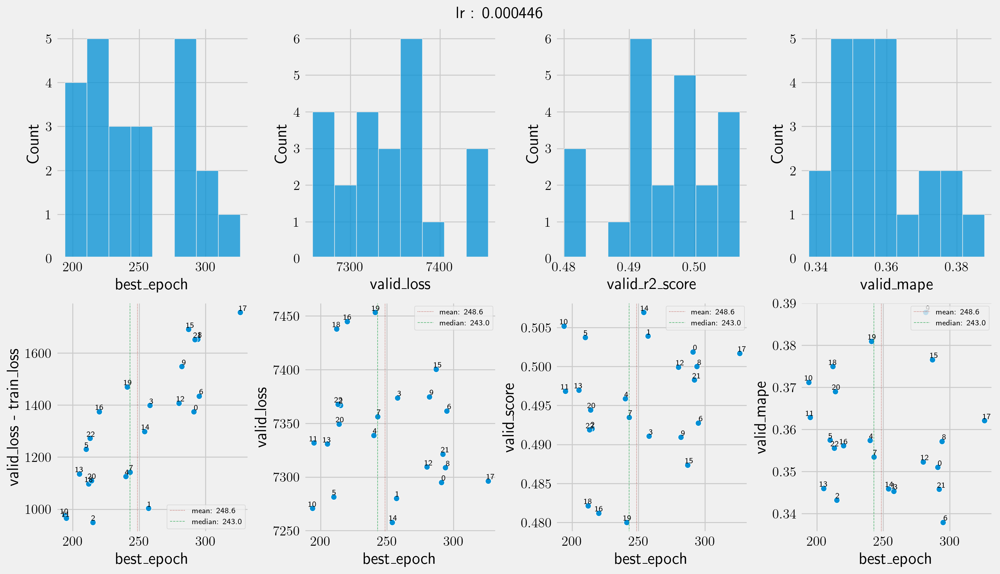
  *<b>도표.19</b> init_lr = 0.000446일 때 best epoch 및 성적 분포*

  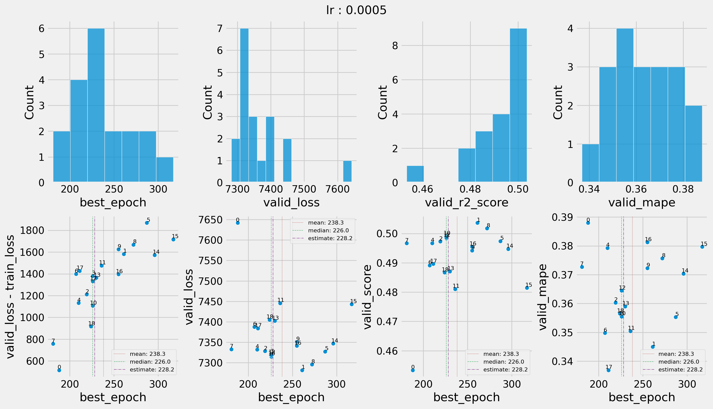
  *<b>도표.20</b> init_lr = 0.000500일 때 best epoch 및 성적 분포*

  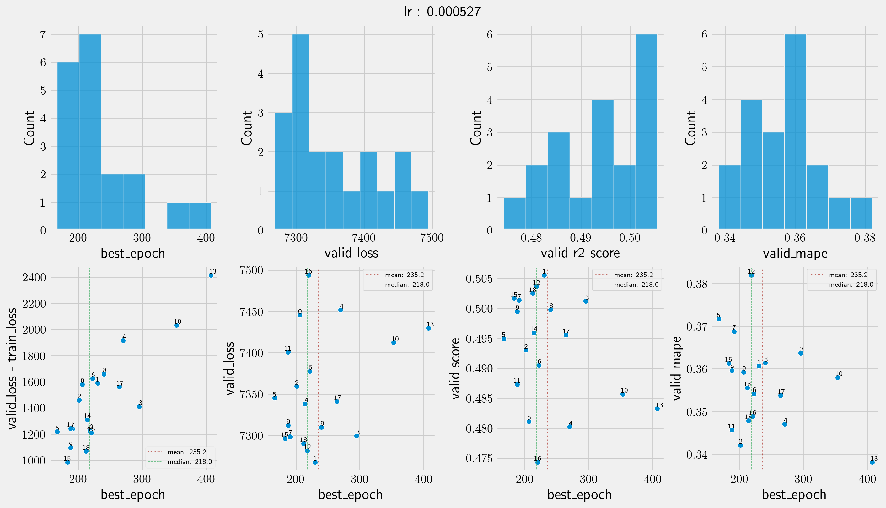
  *<b>도표.21</b> init_lr = 0.000527일 때 best epoch 및 성적 분포*

  
  *<b>도표.22</b> init_lr = 0.000554일 때 best epoch 및 성적 분포*

  - 각 시행에서 *best_epoch*의 분포가 *init_lr*에 따라 달라지는 것을 볼 수 있음
  - *init_lr* 별로 확인을 하였을 때, RMSE 및 $R^2$ Score가 상위권인 시행들의 *best_epoch*가 *best_epoch*의 median 및 mean 값 부근에 있는 것을 확인할 수 있음
  - *best_epoch*가 나중에 등장했을 수록 *valid_loss*와 *train_loss*의 차가 증가하는 것으로 보아, *best_epoch*가 클수록 과적합 됐을 가능성이 높다고 추정 가능

#### *init_lr*과 *best_epoch* 사이 관계

- 위 실험에서는 *patience* 만큼 *score*의 개선이 없으면 *factor* 배 *learning rate*를 감소시키는 scheduling을 사용
- *learning rate*를 지수적으로 감소시키는 scheduling을 VSPU17에서 사용된 scheduling은 큰 차이가 있기 때문에 <i>수식 1[[2]][(VSPU17)]</i>과 직접적인 비교는 쉽지 않음
  - Transformer 모델 제안 논문에서는 <i>수식 1</i>과 같이 <i>step_num-0.5</i>에 비례하여 *learning_rate*를 변화시킴

    

    *<b>수식. 1</b> Transformer 모델 제안 때 사용된 step_num에 따른 learnig rate 값*
- $X=$ *init_lr*과 $y=$ *best_epochd* 사이에 선형회귀 분석
  - $-3\leq d \leq 3 \text{ and } d \neq 0$ 조건을 만족하는 $d$에 대해 시뮬레이션. $0.01$ 간격으로 $d$ 값을 설정
  - 도표.11의 7개의 *init_lr* 중 1.76e-4를 제외한 6개의 *init_lr*에 대해서 추정
    - *init_lr*=1.76e-4의 경우 총 *epoch*가 550으로 제한된 영향을 받았기 때문
- 위 조건을 만족하는 $d$에 대해 *init_lr*으로 *best_epoch*$d$를 선형회귀 했을 때, $d=0.52$일 때 $R^2$ Score가 0.536로 제일 큼

    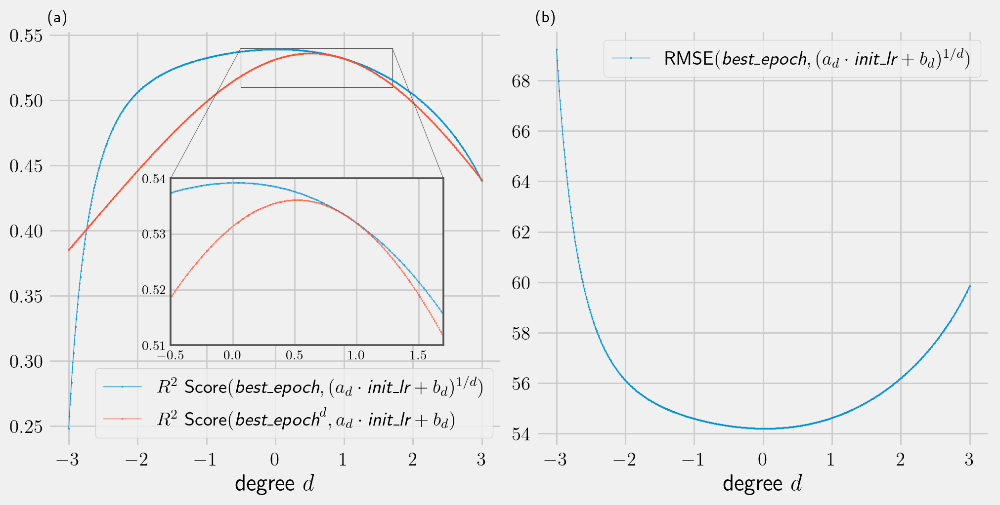
  
    *<b>도표.23</b> 차수 d에 따른 선형회귀 모델의 결과 지표. <b>a.</b> R2 Score, <b>b.</b> RMSE*

  - $d=0.52$일 때의 선형모델을 이용해, *init_lr*으로 *best_epoch*를 추정하는 경우, $R^2$ Score = 0.537, RMSE = 54.305
  - $d=0.03$일 때의 선형모델을 이용해, *init_lr*으로 *best_epoch*를 추정하는 경우, $R^2$ Score = 0.539, RMSE = 54.202으로 성적이 제일 좋음
  - 6개의 *init_lr*에 대하여 각각 38~48개의 *best_epoch* 값이 있기 때문에 $R^2$ Score는 좋은 결과를 얻기 힘듦
  - RMSE값은 *best_epoch*의 *init_lr* 별 표준편차의 weighted mean과 비슷한 값으로 구해짐
    - 도표.15에서 *best_epoch* 값의 *init_lr* 별 표준편차를 weighted mean을 구하면, $56.137$이 나오고, oversampling한 것을 반영하면 $52.595$가 나옴

- 위와 동일한 조건에서, 각 *init_lr*에 대해, *best_epoch*의 대표값만 사용한 경우, median을 사용하면 $d=0.30$일 때 $R^2$ Score가 0.981로 제일 큼

  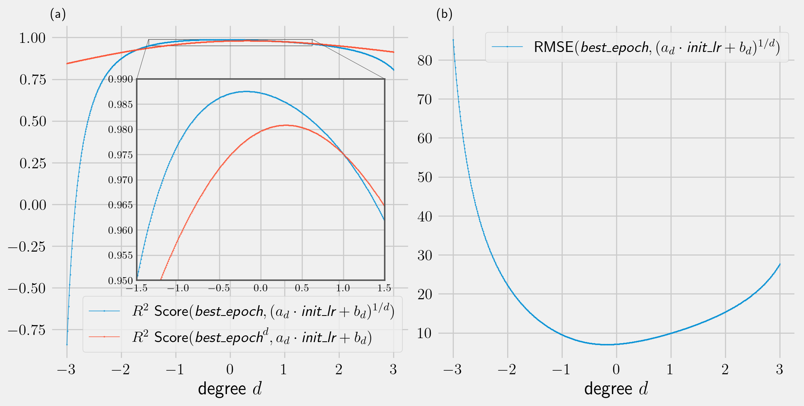

  *<b>도표.24</b> best_epoch의 median의 d 제곱에 대한 선형회귀 모델의 결과 지표. <b>a.</b> R2 Score, <b>b.</b> RMSE*
  
  - $d=0.30$일 때의 선형모델을 이용해, *init_lr*으로 *best_epoch*를 추정하는 경우, $R^2$ Score = 0.985, RMSE = 7.609

- 위와 동일한 조건에서, 각 *init_lr*에 대해, *best_epoch*의 mean 값만을 사용하면 $d=-0.10$일 때 $R^2$ Score가 0.966로 제일 큼

  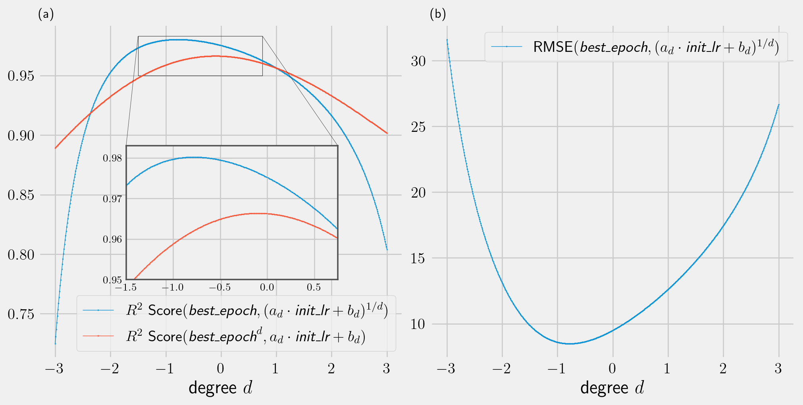

  *<b>도표.25</b> best_epoch의 mean의 d 제곱에 대한 선형회귀 모델의 결과 지표. <b>a.</b> R2 Score, <b>b.</b> RMSE*
  
  - $d=-0.10$일 때의 선형모델을 이용해, *init_lr*으로 *best_epoch*를 추정하는 경우, $R^2$ Score = 0.976, RMSE = 9.275

- 동일한 범위에서 임의로 6개의 값을 골라 같은 조건에서 선형회귀를 하였을 때, 두 $R^2$ Score 모두 0.96 초과, RMSE 10 미만이 나올 확률은 시뮬레이션 결과 약 0.054로 흔치는 않은 확률
  - \[149, 550\]에 포함된 임의의 6개의 서로 다른 수 $\text{y}_i$에 대해서, $\text{y}_i^d$ = $aX_i + b, d\in [-3, 3] \subset \mathbb{Q}$로 선형회귀하는 시뮬레이션 진행
    - $550\geq \text{y}_0 > \cdots > \text{y}_5 \geq149, \quad X_0=2.84e-4<\cdots<X_5=5.54e-4$
  - 총 경우의 수가 $5.65e+12$개인 분포에 대해 1,000번 독립 시행
  - $d$가 정수가 아닌 유리수인 경우, $aX+b < 0$ 이 되면 $\text{y}$가 실수로 정의되지 않을 수 있음. 이 경우, 모델은 $\text{y}=0$으로 추정. 이 경우 성적이 좋게 나오기 힘듦.
  - 단조 감소면서 변곡점이 없어야 하고 모든 $\text{y}_i^d$ 값이 양수로 예측되어야 높은 R2 Score를 얻을 수 있음
  
  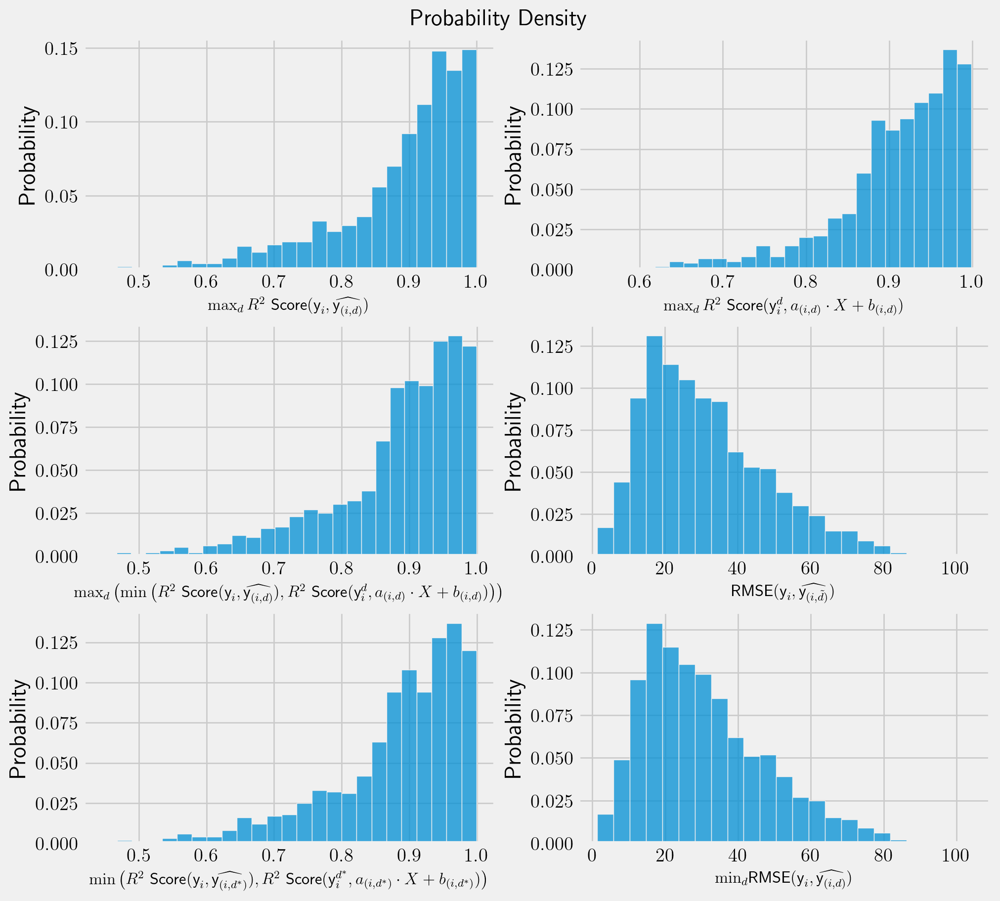

  *<b>도표.26</b> 시뮬레이션에 따른 max R2 score, min RMSE의 통계적 확률 분포*

  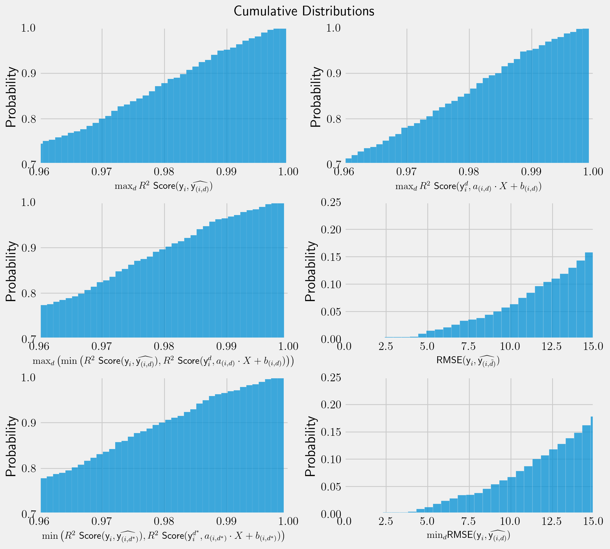

  *<b>도표.27</b> 시뮬레이션에 따른 max R2 score, min RMSE의 누적 확률 분포*

  - notation
    - $`\hat{y}_{(i,d)}`$ : $y_i$에 대한 $d$차 추정값. 즉, $`(a_{(i,d)}X_i+b_{(i,d)})^{1/d}`$ or $0$
    - $\tilde{d}$ : $`\text{argmax}_{d}(\text{min}(R^2\text{ Score}(y_i,\hat{y}_{(i,d)}),R^2\text{ Score}(y_i^{d},a_{(i,d)}X_i+b_{(i,d)})))`$
    - $d^*$ : $\text{argmin}_d$ RMSE$`(y_i,\hat{y}_{(i,d)})`$

  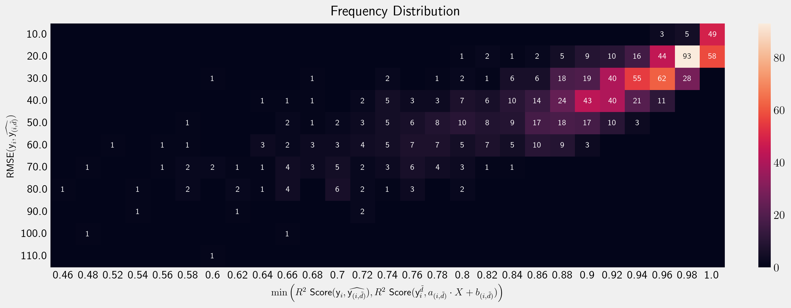

  *<b>도표.28</b> d = d tilde 일 때 R2 score, RMSE에 따른 도수 분포표. 예를 들어, 우상단의 49는 RMSE 0이상 10미만, R2 score 0.98초과 1.00이하에 대한 도수*

  - 즉, $`0\leq \text{RMSE}(y_i,\hat{y}_{(i,\tilde{d})})<10`$, $`0.96 < R^2\text{ Score}(y_i,\hat{y}_{(i,\tilde{d})}),R^2\text{ Score}(y_i^{\tilde{d}},a_{(i,{\tilde{d}})}X_i+b_{(i,\tilde{d})}) \leq 1.0 `$에 대한 통계적 확률은 0.054
<!--
- *step_num* = *dataset_size* $\cdot$ *epoch* 
-->

  

  *<b>도표.29</b> init_lr과 best epoch과 사이 산포도 및 회귀선*

- test : 1.76e-4의 median, mean에 대해 비교

  ||median|mean|
  |-|-:|-:|
  |predict|473.17|491.01|
  |actual|466|465.14|
  |error|7.17|25.01|

  *<b>도표.30</b> init_lr = 1.76e-4에서 median 및 mean 값 예측 및 차이*

  - median, mean을 각각 d=0.3, -0.1일 때 회귀 모델로 예측함
  - median의 오차에 비해 mean의 오차가 큼
    - mean보다 median이 최대 epoch 수가 제한된 것의 영향을 덜 받기 때문으로 예상
  - median을 예측할 때, 1.76e-4에서의 예측값이 d에 따라 편차가 있음
    - validation 및 test set을 추가로 구성하면 적합한 d의 범위를 좁힐 때 도움을 받을 수 있을 것으로 예상

  

  *<b>도표.31</b> init_lr과 best epoch의 median 사이의 회귀모델*

### 모델 성능

#### Best Model

- 선정 기준 :
  - best epoch일 때 valid loss의 값들을 평균을 취했을 때, 가장 잘 나온 *init_lr*를 고름
  - *init_lr*= 4.46e-4일 때, test loss가 가장 작을 때를 best model로 정함

    | **Best Model**|       Train |       Valid |        Test |
    |:------|------------:|------------:|------------:|
    |RMSE    | 5656.03     | 7308.7      | 8337.54     |
    |MAPE    |    0.30884  |    0.357172 |    0.359422 |
    |R2_SCORE|    0.735617 |    0.499996 |    0.4744   |

    *<b>도표.32</b> batch_size = 20480 일 때 best model의 성능*

- 학습 추이 및 결과:

  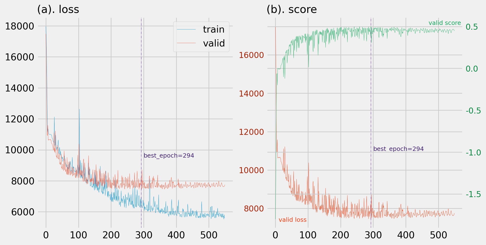

  *<b>도표.33</b> best model의 학습에 따른 train loss와 valid loss (RMSE), valid score (R2 Score)*
  
  

  *<b>도표.34</b> test set의 정가, best model의 절대오차 및 상대오차 histogram*

  - 정가 60000원 미만의 데이터가 test set 기준 0.9938의 비율을 차지
    - train, valid set 기준 각각 0.9941, 0.9948의 비율을 차지
  - best model의 test set 예측값에서 오차의 최소는 -530609.5 최대는 146356.1, 절대 오차의 최소는 0.0742
    - 오차가 -20000 이상 20000 미만의 비율이 0.9829
  - 상대오차의 최소와 최대는 각각 -0.9434, 35.3836. 절대값을 취한 상대오차의 경우 최소값이 5.0148e-6
    - 상대오차가 -1 초과 4 미만인 데이터의 비율은 0.9954

  

  *<b>도표.35</b> best model의 test 데이터에 대해 참 값에 따른 예측값의 산포도*

<!--
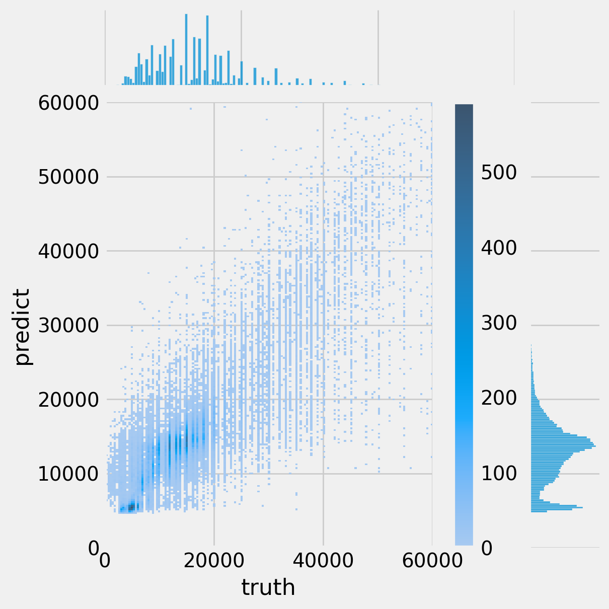

*<b>도표.</b> best model의 정가 60,000원 이하 train 데이터에 대해 참 값에 따른 예측값의 histogram*

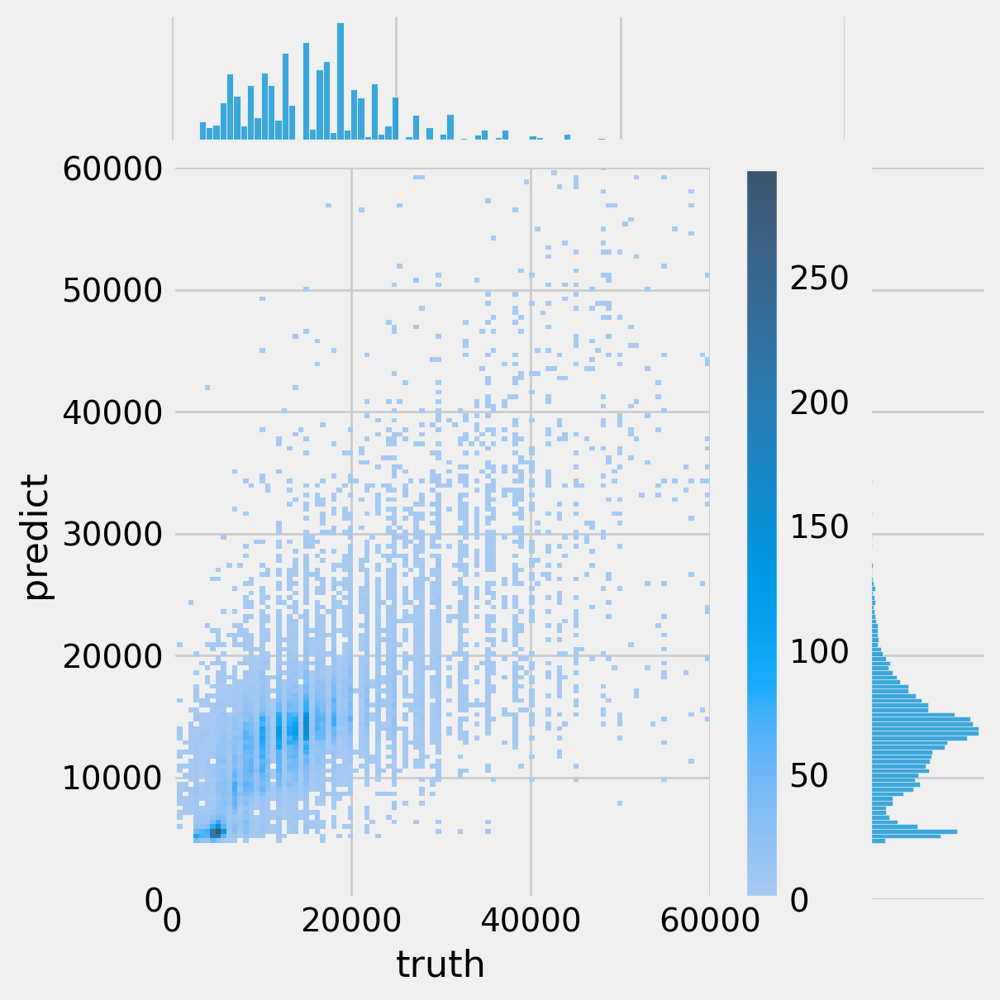

*<b>도표.</b> best model의 정가 60,000원 이하 valid 데이터에 대해 참 값에 따른 예측값의 histogram*
-->
  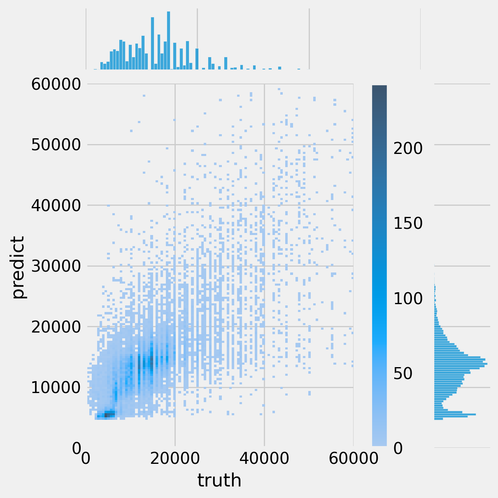

  *<b>도표.36</b> best model의 정가 60,000원 이하 test 데이터에 대해 참 값에 따른 예측값의 histogram*

  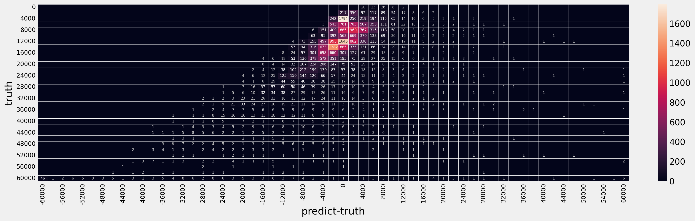

  *<b>도표.37</b> best model의 test 데이터 예측값에 대한 오차의 도수분포표*

  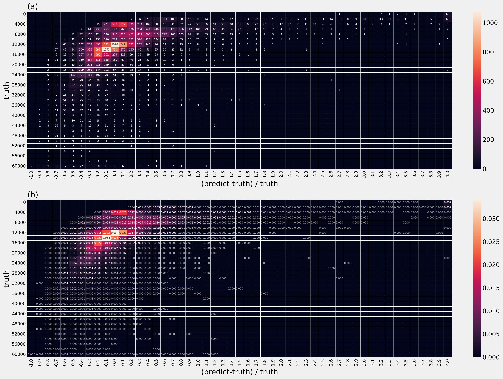

  *<b>도표.38</b> best model의 test 데이터 예측값에 대한 상대 오차의 도수분포표. <b>a.</b> 절대도수 <b>b.</b> 상대도수*

  - 도표.38.b에서 회색 글씨로 상대도수가 표시된 부분은 0.01 미만인 부분
    - 도표.38.b에서 상대도수가 0.01 이상인 부분들의 비율은 총 0.9009

  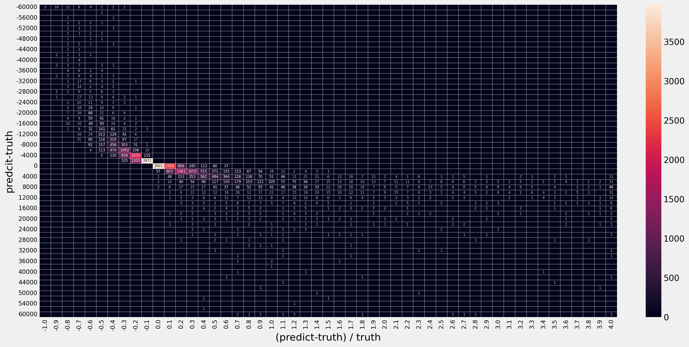

  *<b>도표.39</b> best model의 test 데이터 예측값에 대한 오차와 상대 오차의 도수분포표*

  - 도수분포표에서 각 계급은 가리키는 값 이상 그 다음 값 미만에 해당하는 데이터의 수 혹은 비율
    - e.g. 도표.37에서, 정가 4000원 이상 6000원 미만 가격의 책 중 예측값-참값이 0이상 2000원 미만인 데이터의 수는 1794
    - 다만 맨 끝의 계급은 구간 바깥의 값도 포함하고 있음
      - e.g. 도표.38.a에서, 정가 0원 이상 2000원 미만 가격의 책 중 상대 오차의 값이 4.0 이상인 데이터의 수는 68
      - e.g. 도표.39에서 -60000,-1.0에 해당하는 계급은 오차가 -58000 미만 상대오차가 -1.0 이하인 것으로, 해당 데이터의 수는 2
  - 오차가 -20000 이상 20000 미만의 비율이 0.9829, -8337.54 이상 8337.54 미만의 비율이 0.8894, -6000 이상 6000 미만의 비율이 0.8013, -3000 이상 3000 미만의 비율은 0.5504. 절대 오차의 평균은 4163.47
    - RMSE가 8337.54인 것을 감안하면, 절대오차가 8337.54 이상인 데이터의 수는 적지만, 절대오차가 매우 커서, RMSE 성능을 떨어뜨리는데 큰 영향을 주고 있음
  - 상대 오차가 -0.3 이상 0.3 미만인 부분의 비율은 0.6356, -0.4 이상 0.4 미만인 부분의 비율은 0.7427
    - MAPE가 0.359인 것을 감안하면, 상대 오차가 -0.4 미만 0.4 이상인 부분은 매우 넓게 분포해 있음을 추론 가능
  
  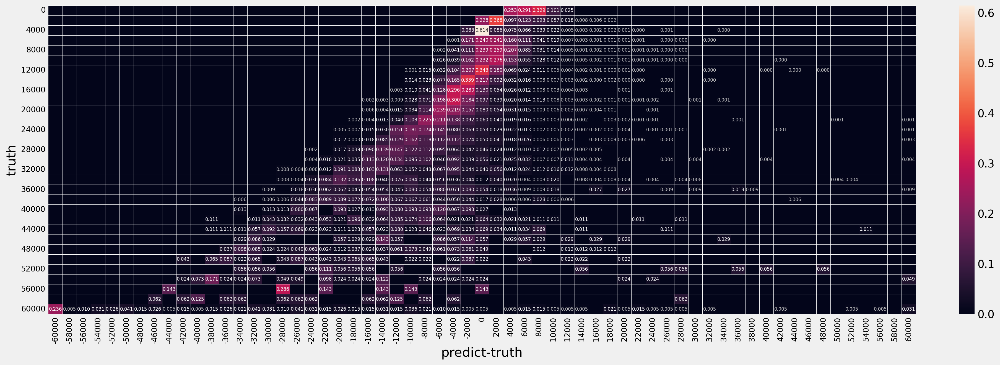

  *<b>도표.40</b> best model의 test 데이터에서 각 정가 가격대 별 오차의 분포*

  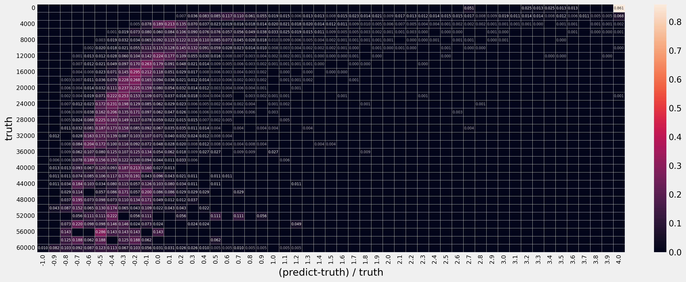

  *<b>도표.41</b> best model의 test 데이터에서 각 정가 가격대 별 상대오차의 분포*
  
  - 도표.40, 도표.41은 각각 도표.37, 도표.38.a에서 행 별로 합을 구한 뒤 나누어, 각 행 내에서 오차 혹은 상대오차가 어떤 비율로 분포하고 있는지 보기 위해 표시한 것
  - 20000원 미만의 도서에 대해서 상대적으로 오차와 상대오차가 작고, 그 이상으로 가면 정확도가 점차 떨어짐

  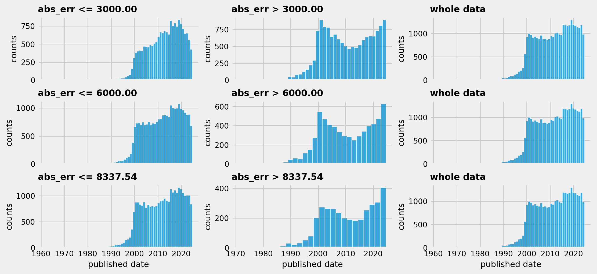

  *<b>도표.42</b> best model의 test 데이터에서 절대오차가 높은 데이터와 낮은 데이터에서 출판일시의 분포*
  
  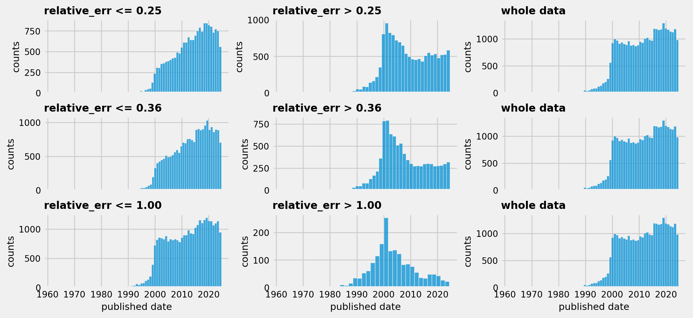

  *<b>도표.43</b> best model의 test 데이터에서 상대오차가 높은 데이터와 낮은 데이터에서 출판일시의 분포*
  
  - 2000년대에 출간된 도서의 경우 상대적으로 절대오차와 상대오차가 클 가능성이 높은 것으로 보임

#### 대조군 모델

- 동일한 방식으로 전처리한 데이터를 이용하여 회귀 예측 모델 설계
- **Random Forest Regressor** (이하 RFR) : 기본 hyperparameter로 진행
  - 성능

    | **RFR**|       Train |       Valid |        Test |
    |:---------|------------:|------------:|------------:|
    | RMSE     | 3175.18     | 8179.46     | 9079.71     |
    | MAPE     |    0.106272 |    0.298254 |    0.301357 |
    | R2_SCORE |    0.916681 |    0.373757 |    0.376662 |
  
    *<b>도표.44</b> 전체 데이터에 대한 RFR model 성능*

<!--
    | **test2**|       Train |       Valid |        Test |
    |:---------|------------:|------------:|------------:|
    | RMSE     | 2215.93     | 6188.06     | 6078.94     |
    | MAPE     |    0.105727 |    0.29688  |    0.299907 |
    | R2_SCORE |    0.926039 |    0.418558 |    0.444744 |

    *<b>도표.</b> 정가 60,000 이하 데이터에 대한 RFR model 성능*
-->

- **XGBoost Regressor** (이하 XGB)
  - 독립변수가 동일한 알라딘 중고도서 가격 예측[[1]][(OLPJ24)]의 결과를 참조하여 hyperparameter 결정 <!-- Expt.4에서 가장 성능이 좋았던 hyperparameter로 진행-->

    |*num_boost_round*|  *learning_rate*|  *max_depth*|
    |-:|-:|-:|
    |2500|  0.3|  6|  

    |*min_child_weight*|  *colsample_bytree*|  *subsample*|
    |-:|-:|-:|
    |4|  1|  1|
  
    *<b>도표.45</b> XGBoost 관련 hyperparameter*

  - 성능

    | **XGB**|       Train |       Valid |        Test |
    |:---------|------------:|------------:|------------:|
    | RMSE     | 8083.08     | 8429.75     | 9544.35     |
    | MAPE     |    0.351907 |    0.36065  |    0.366424 |
    | R2_SCORE |    0.460038 |    0.334845 |    0.311233 |

    *<b>도표.46</b> 전체 데이터에 대한 XGBoost model 성능*

<!--
  | **test2**|       Train |       Valid |        Test |
  |:---------|------------:|------------:|------------:|
  | RMSE     | 5947.53     | 6333.92     | 6321.06     |
  | MAPE     |    0.350769 |    0.359319 |    0.36484  |
  | R2_SCORE |    0.467198 |    0.390825 |    0.399632 |

    *<b>도표.</b> 정가 60,000 이하 데이터에 대한 XGBoost model 성능*
-->

- **MLP Regressor**
  - 5개 층으로 구성하여 학습 진행, 활성화 함수는 ReLU
  - 세부 사항

    |입력|출력|비고|
    |:-:|:-:|-|
    |64|256||
    |256|32|batch norm과 dropout을 적용|
    |32|32|batch norm과 dropout을 적용|
    |32|8|batch norm과 dropout을 적용|
    |8|1|output 출력|

    *<b>도표.47</b> MLP model의 각 layer별 입력 및 출력 tensor의 차원*
  
    |init_lr|factor|adam_eps|patience|warmup|
    |-:|-:|-:|-:|-:|
    |0.015|0.999995|5e-7|15|3|

    |epoch|clip|weight_decay|dropout|
    |-:|-:|-:|-:|
    |700|1.0|5e-9|0.1|

    *<b>도표.48</b> MLP model 학습 hyperparameter*
  
  - 학습 결과
  
    |**MLP**|Train|Valid|Test|
    |-|-:|-:|-:|
    |RMSE|8638.70|8893.68|10034.56|
    |MAPE|0.37203|0.38830|0.39802|
    |R2 SCORE|0.38263|0.26371|0.23795|

    *<b>도표.49</b> 전체 데이터에 대한 MLP model 성능* 

## 7. 결과 분석

|        |Encoder Based Model|        RFR |        XGB  |        MLP  |
|--------|-----------------------:|-----------:|------------:|------------:|
|RMSE    | 8337.54     | 9079.71    | 9544.35     | 10034.56    |
|MAPE    |    0.359422 |    0.30136 |    0.36642  |    0.39802  |
|R2 SCORE|    0.4744   |    0.37666 |    0.31123  |    0.23795  |

*<b>도표.50</b> 각 실험 별 best model과 성능*

- MAPE는 RFR이 제일 좋으나, R2 Score가 가장 높은 것, 즉 책 정보의 변화가 가격 예측의 차이에 가장 잘 반영된 것은 encoder based model
- 이에 encoder based model일 때 RMSE도 가장 작게 나왔음
- batch size 20480 기준, A100으로 encoder based model 학습시 550epoch에 약 1시간 걸림. init_lr = 4.46e-4 기준, best epoch의 median이 243, q3가 283.5인 것을 감안하면, 300 epoch로도 충분할 것으로 예상 (약 36분)
  - 4.46e-4~5.54e-4 중 정한다면 *init_lr*의 차이로 성능을 개선하고자 하는 것은 큰 의미가 없을 수 있음.
- $-1<d<1, d\neq0$에 대해 *init_lr*과 *best_epochd* 사이 선형관계를 가짐. 다만, 각각의 *init_lr*에 대한 *best_epoch*의 표준편차가 크기 때문에 d를 더 좁히는 것은 현 데이터로는 과하다 판단.

## 8. 결론 및 한계

### 결론

- 간단한 Machine-learning 모델과 MLP보다 encoder based model이 RMSE 및 R2 Score 측면에서 더 좋은 성능이 나옴
  - 또한 Valid 및 Test Score의 차이가 더 적은 것으로 보아, 자연어 처리 결과를 더욱 잘 반영하고 있다 판단 가능
- *init_lr*과 *best_epoch*$^d$ 사이에 단조 감소 및 선형 관계성을 있다 볼 수 있지만, 각 *init_lr*별 *best_epoch*의 표준편차가 커서 차수 d를 정하기 위해서는 추가적인 실험 및 조사 필요
  - *best_epoch*의 중앙값 혹은 평균의 d제곱의 경우 $-0.75\leq d\leq0.75, d\neq 0$의 차수 d에 대해 R2 Score가 0.96 초과, RMSE 10 미만인 모델로 회귀분석이 가능
  - 임의로 149이상 550이하 숫자를 6개 뽑아 감소하는 순서로 나열할 경우, 위와 같은 성적이 나올 수 있는 숫자가 뽑힐 확률은 0.054가량
  - *init_lr*의 개수가 6개로 적기 때문에 $d<-0.75$ or $0.75<d$를 기각하기는 힘듦. 다만, 추가적인 실험을 했을 때 의미있는 결과가 나올 수 있다 추정 가능

### 한계 평가

- 정가가 outlier에 해당하는 데이터를 학습에서 제외했을 때 성능이 개선되는지 확인 필요
- 도서 정가가 보통 1000원 단위로 결정되고, 100원 단위 미만으로는 대부분 값이 비어있는 특징을 encoder based model 학습에는 반영하지 못했음
  - parameter 양자화를 하면, 학습 및 추론 속도도 향상될 수 있음
- 정가 예측에 큰 도움을 줄 수 있는 추가적인 정보(제본 형태, 쪽수 등)를 데이터셋에 추가하지 않고 학습 진행
  - 현 실험에서 hyperparmeter 조정하는 것보다 해당 데이터 추가하는 것이 성적 향상에 더 큰 영향을 줄 것으로 예상
- Attention을 이용한 다양한 모델, 특히 attention layer로만 구성된 모델을 이용한 학습을 시도해보지 못함
- 행렬 계산을 이용한 Transformer 모델이 연산속도 측면에서 갖는 장점을 충분히 활용했는지 평가 필요
  - *d_model*의 값이 커도 모델의 step 당 연산 속도에 큰 영향을 주지 않는 것이 연산 속도 측면에서 큰 장점
  - *d_model*의 값이 크면 parameter의 개수가 많아지므로, 원활한 학습에 필요한 데이터 양, step 등이 커질 수 있음
  - 따라서 *d_model*의 값을 설정할 때 한계가 있는 상황인데, 데이터 셋을 확장하는 등 *d_model*을 늘려도 괜찮을 수 있는 조사를 하지 않음
- 저자명, 출판사를 인코딩 중 기타 항목으로 처리할 때 threshold 기준의 구체적인 근거를 제시하지 못 함
  - 추가적인 조사를 통해 더 객관적이고 제시 가능한 근거 확립 가능

## 9. 추후 과제

- 출간 연도 등으로 stratify하여 학습할 때 성능을 높히는 것이 가능한지 확인
- *d_model*, *d_ff*, *head*, *N* 등의 모델 구조 관련 hyperparameter를 변경했을 때 성능이 어떻게 달라지는지 확인
- *d*의 범위를 더 좁히기 위해 할 수 있는 추가적인 조사
  - 선행 연구 및 관련 참고자료 조사
  - *batch_size*에 따른 변화 추적
  - 더 다양한 scale의 *init_lr*에서 조사
- *d_model*, *batch_size* 등이 *best_epoch*에 끼치는 영향을 확인
- MLP와 혼합하지 않은 모델 개발 및 성능 비교
  - 단어 corpus를 다른 열의 내용에 대하여도 확장
  - 혹은 다른 embedding model로 vector화 된 정보들이 섞여있을 경우 학습에 주의 할 점 조사
- 데이터를 보강하여 학습에 수월한 질 좋은 데이터셋 구성
  - 도서 정보 페이지에 정보 중, 도서 정가에 직접적인 영향을 주는 다른 정보(제본형태, 쪽수 등)를 추가적으로 크롤링
  - 베스트 셀러에 포함된 적 없는 도서도 대상으로 하기 위한 크롤링 방법 개발 필요
- 위의 모델 외에도 다양한 모델 개발 가능
  - 카테고리와 도서 명, 출판사, 정가 등의 정보로 출간 연도 예측
  - 도서 정보 및 중고 시장에서의 가격을 바탕으로 알라딘의 SalesPoint 산정법 추정

## 10. 참고문헌

1. [OLPJ24][(OLPJ24)] : Doeun Oh, Junseong Lee, Yerim Park, and Hongseop Jeong, 알라딘 중고 도서 데이터셋 구축 및 그에 기반한 중고 서적 가격 예측 모델, GitHub, 2024
2. [VSPU17][(VSPU17)]: Vaswani, Ashish and Shazeer, Noam and Parmar, Niki and Uszkoreit, Jakob and Jones, Llion and Gomez, Aidan N and Kaiser, Lukasz and Polosukhin, Illia, Attention is All you Need, Advances in Neural Information Processing Systems, 30, 2017
3. [K19][(K19)]: hyunwoongko, transformer, GitHub, 2019

[(OLPJ24)]:https://github.com/kdt-3-second-Project/aladin_usedbook "OLPJ24"
[(VSPU17)]:https://arxiv.org/abs/1706.03762 "VSPU17"
[(K19)]:https://github.com/hyunwoongko/transformer/tree/master "K19"
